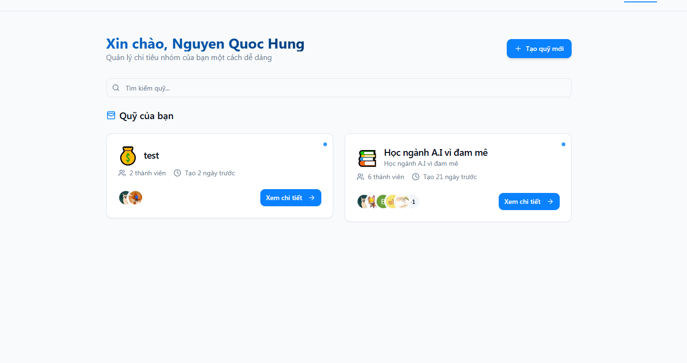
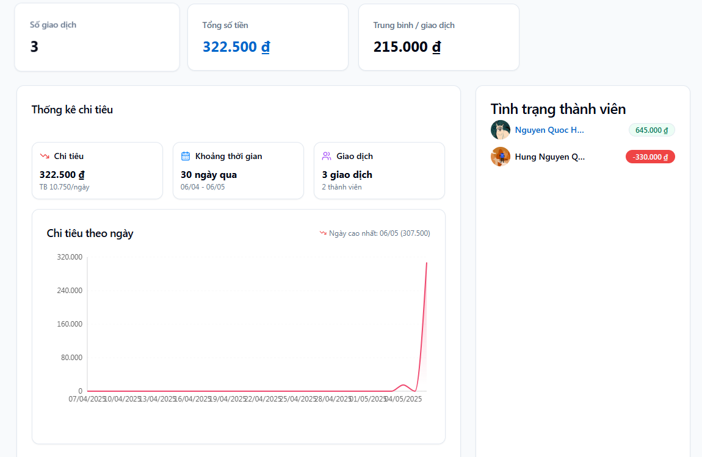
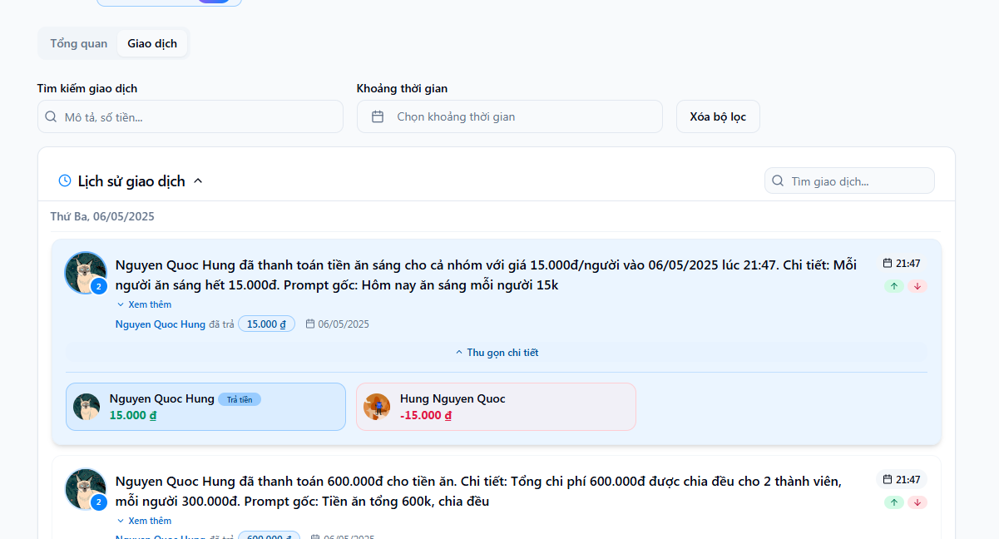
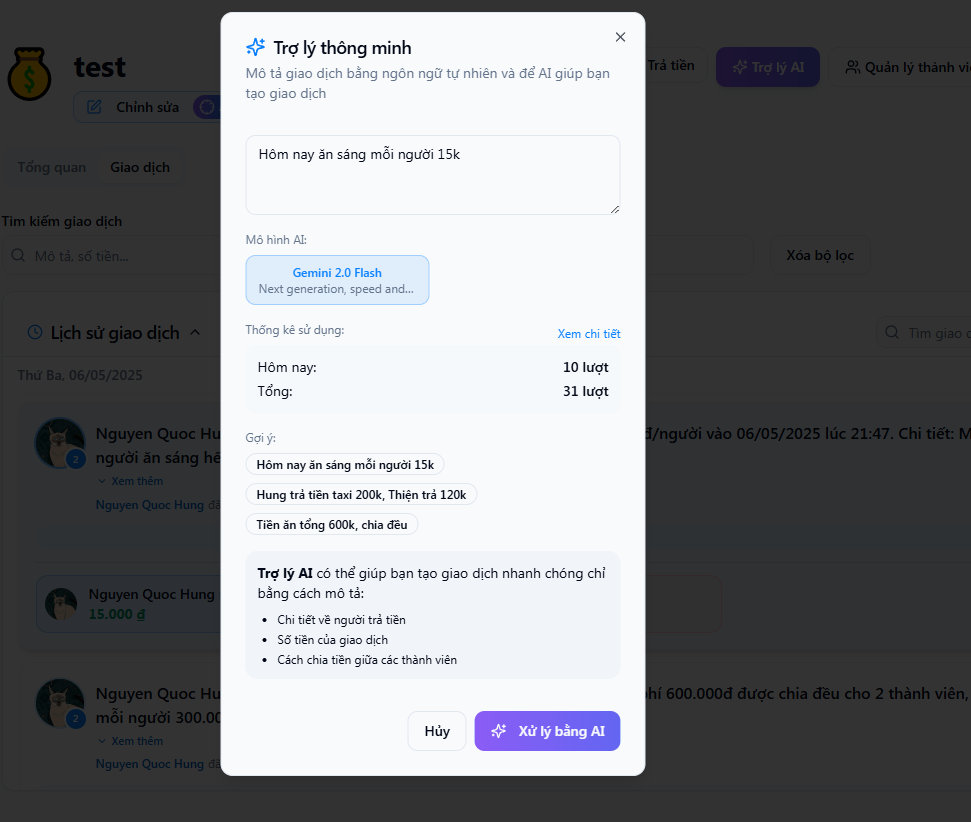
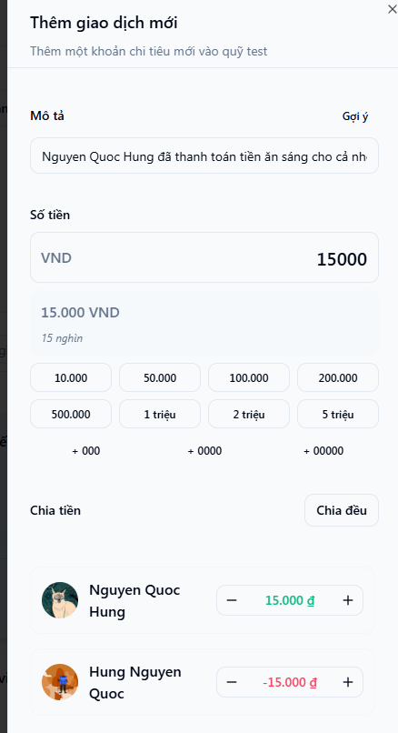
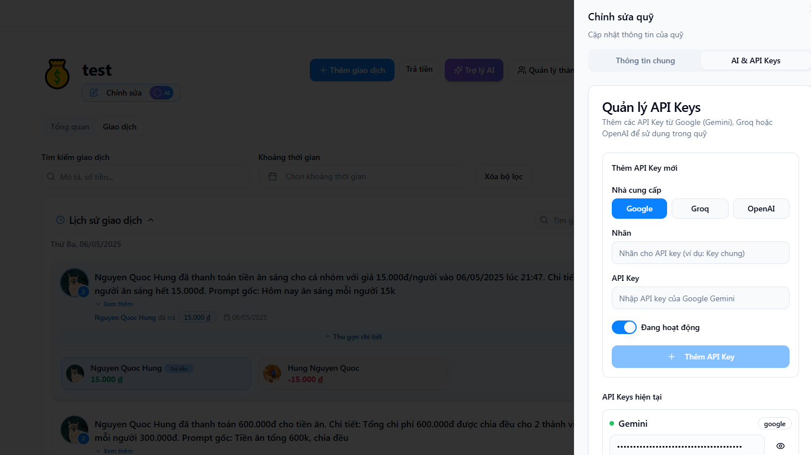
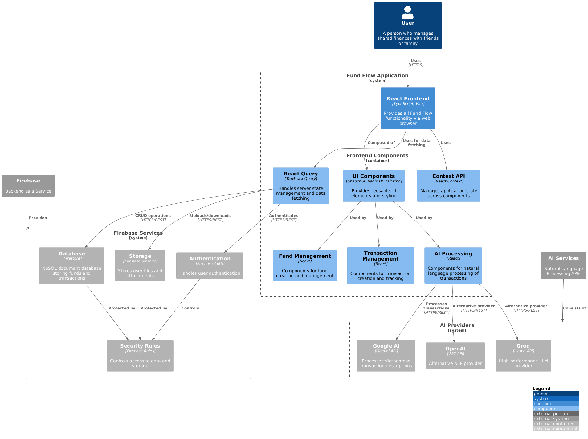

# Fund Flow

A modern, real-time fund management application for sharing and tracking expenses between friends, families, and groups. Using A.I for fast expense parsing and Vietnamese language processing.

Note: This system NOT integrate with any payment gateway. This create a flexible system for users to manage their funds. You can payback each other with any payment method you want and verify by trust










## 📋 Table of Contents

- [Overview](#overview)
- [System Architecture](#system-architecture)
- [Tech Stack](#tech-stack)
- [Features](#features)
- [Installation](#installation)
- [Setting Up Firebase](#setting-up-firebase)
- [Development](#development)
- [Production Deployment](#production-deployment)
- [Security Considerations](#security-considerations)
- [Contributing](#contributing)

## 🌐 Overview

Fund Flow Style is a responsive web application designed to simplify shared expense management. It enables users to create funds for different groups, add members, track transactions, and automatically calculate balances with support for Vietnamese language processing.

The application solves the common problem of tracking "who owes who" in shared expenses scenarios, with particular optimization for Vietnamese language patterns when describing expense splits.

## 🏗️ Overview Architecture



The application architecture follows a modern client-side approach with Firebase as the backend, featuring advanced natural language processing through multiple AI services.

### Architectural Layers

1. **Frontend Layer**: 
   - React application with TypeScript and Vite build system
   - Modular components organized by functionality
   - Responsive design for all device sizes

2. **State Management**: 
   - React Query for server state and optimized data fetching
   - Context API for application-wide state sharing
   - Local component state for UI interactions

3. **Backend Services**: 
   - Firebase Authentication for secure user management
   - Firestore for real-time NoSQL database storage
   - Firebase Storage for files and attachments
   - Robust security rules enforcing access controls

4. **AI Integration**: 
   - Multiple AI service providers (Google, OpenAI, Groq)
   - Natural language processing optimized for Vietnamese
   - API key management at the fund level for team sharing
   - Usage tracking and statistics

5. **Security**: 
   - Comprehensive Firebase security rules
   - Environment variable configuration
   - Protected API key storage

## 🛠️ Tech Stack

- **Frontend Framework**: React 18 with TypeScript
- **Routing**: React Router 6
- **State Management**: React Query, React Context API
- **UI Components**: ShadcnUI, Radix UI, Tailwind CSS
- **Build Tool**: Vite
- **Backend**: Firebase (Authentication, Firestore, Security Rules)
- **External APIs**: Google AI, OpenAI, Groq
- **Package Manager**: npm/bun

## ✨ Features

### Authentication & User Management
- Firebase Authentication integration
- Protected routes and user profiles

### Fund Management
- Create and manage shared funds
- Add/remove members to funds
- Archive funds
- Fund settings and customization

### Transaction Tracking
- Add, edit, delete transactions
- Split expenses among members
- Natural language processing for Vietnamese expense descriptions
- Multiple transaction categorization options

### AI Integration
- Smart parsing of expense descriptions
- Support for multiple AI models (Gemini, Llama 3, etc.)
- API key management per fund
- Usage tracking and statistics

### Mobile Optimization
- Responsive design for all devices
- Touch-friendly controls
- Optimized input mechanisms for mobile

## 🚀 Installation

### Prerequisites

- Node.js 18+ or Bun
- Firebase account
- (Optional) AI service API keys (Google, OpenAI, Groq)

### Setup

1. Clone the repository

```bash
git clone https://github.com/quochung-cyou/FundFlow.git

```

2. Install dependencies

```bash
npm install
# or with Bun
bun install
```

3. Create environment file

```bash
cp .env.example .env
```

4. Update the `.env` file with your Firebase and API credentials

## 🔥 Setting Up Firebase

1. Create a new Firebase project at [Firebase Console](https://console.firebase.google.com/)

2. Enable Authentication services
   - Go to Authentication > Sign-in method
   - Enable Email/Password and Google providers

3. Set up Firestore database
   - Create a Firestore database in production mode
   - Set up initial security rules

4. Update your Firebase configuration
   - Create `src/firebase/config.ts` with your Firebase project credentials (use `.env` variables)

```typescript
// Import the functions you need from the SDKs you need
import { initializeApp } from "firebase/app";
import { getAuth } from "firebase/auth";
import { getAnalytics } from "firebase/analytics";
import { getFirestore } from "firebase/firestore";

// Your web app's Firebase configuration
const firebaseConfig = {
  apiKey: import.meta.env.VITE_FIREBASE_API_KEY,
  authDomain: import.meta.env.VITE_FIREBASE_AUTH_DOMAIN,
  projectId: import.meta.env.VITE_FIREBASE_PROJECT_ID,
  storageBucket: import.meta.env.VITE_FIREBASE_STORAGE_BUCKET,
  messagingSenderId: import.meta.env.VITE_FIREBASE_MESSAGING_SENDER_ID,
  appId: import.meta.env.VITE_FIREBASE_APP_ID,
  measurementId: import.meta.env.VITE_FIREBASE_MEASUREMENT_ID
};

// Initialize Firebase
const app = initializeApp(firebaseConfig);
export const auth = getAuth(app);
export const analytics = getAnalytics(app);
export const db = getFirestore(app);
export default app;
```

5. Deploy Firebase rules

```bash
npm run deploy-rules
```

## 🧪 Development

```bash
npm run dev
# or with Bun
bun run dev
```

This will start the development server at `http://localhost:5173`

## 📦 Production Deployment

1. Build the application

```bash
npm run build
# or with Bun
bun run build
```

2. Deploy to Firebase Hosting

```bash
firebase deploy
```

## 🔒 Security Considerations

### Important Security Notes

1. **API Keys Protection**
   - DO NOT commit API keys directly in source code
   - Use environment variables for all sensitive credentials
   - If you found hardcoded API keys in `config.ts`, move them to `.env` immediately

2. **Firebase Security Rules**
   - Review and update the Firestore security rules in `firestore.rules`
   - Ensure proper access control for all collections

3. **API Key Management**
   - The application supports storing API keys in Firestore
   - Ensure only authorized users can access these keys

## 🤝 Contributing

Contributions are welcome! Please feel free to submit a Pull Request.

1. Fork the repository
2. Create your feature branch (`git checkout -b feature/amazing-feature`)
3. Commit your changes (`git commit -m 'Add some amazing feature'`)
4. Push to the branch (`git push origin feature/amazing-feature`)
5. Open a Pull Request
